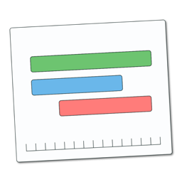
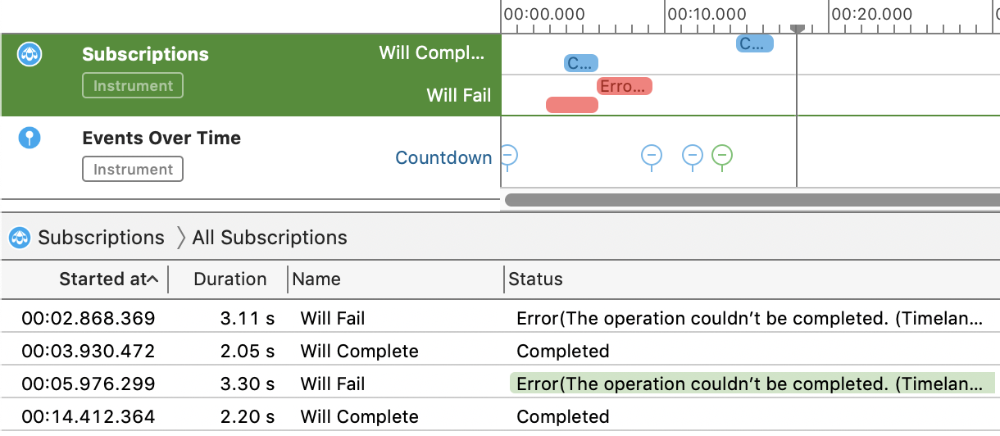
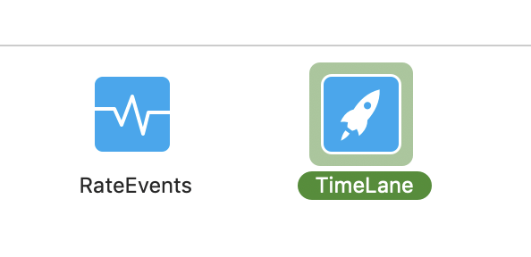
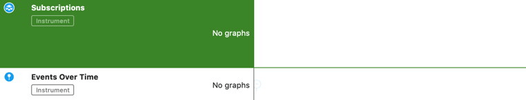
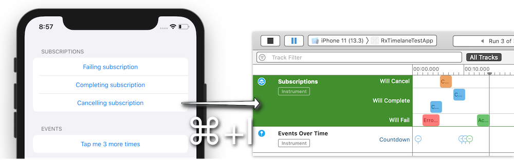

# OperationTimelane ß



> Note: Pre 1.0 software.

**OperationTimelane** provides an API allowing you to debug your `Operation` based asynchronous code visually in the Timelane Instrument.



<p align="center">
    
    
    
</p>

#### Contents:

 - [Usage](#Usage)
 - [API Reference](#Reference)
 - [Installation](#Installation)
 - [Demo](#Demo)
 - [License](#License)

# Usage

## Install Timelane Instrument

Download the latest release of the Timelane Instrument and install it on your computer: http://timelane.tools/#download.

## Debugging specific operation

Import the OperationTimelane framework in your code:

```swift
import OperationTimelane
```

Use the `lane(_)` function to "activate" an operation for debugging in Timelane when you are creating the operation:

```swift
let op = MyOperation().lane("My Operation")
```

Then profile your project by clicking **Product > Profile** in Xcode's main menu.

Select the Timelane Instrument template:



Inspect your operations on the interactive timeline:



## Debugging specific operation queue

`OperationTimelane` offers a custom operation queue which automatically logs any added operations in Timelane. (No swizzling in favor of a custom type.)

Create a `LaneOperationQueue` (in other words replace your existing queue with) like so and then add operations as usual:

```swift
let myQueue = LaneOperationQueue(name: "My Queue")

myQueue.addOperation(...)
myQueue.addOperation(...)
myQueue.addOperation(...)
```

All of the added operations will be visualized in Timelane like in the previous section.

For a more detailed walkthrough go to [http://timelane.tools](http://timelane.tools).

# API Reference

### `Operation.lane(_:filter:)`

Use `lane("Lane name")` to send data to both the subscriptions and events lanes in the Timelane Instrument.

`lane("Lane name", filter: [.subscriptions])` sends begin/completion events to the Subscriptions lane.

`lane("Lane name", filter: [.events])` sends events and values to the Events lane.

### `Operation.laneValue(_)`

Use this function if you want to log a value for the current operation in Timelane.

### `LaneOperationQueue`

Temporarily replace your own operation queue with this type to debug its operations in Timelane.

# Installation

## Swift Package Manager

I . Automatically in Xcode:

 - Click **File > Swift Packages > Add Package Dependency...**  
 - Use the package URL `https://github.com/icanzilb/OperationTimelane` to add TimelaneCombine to your project.

II . Manually in your **Package.swift** file add:

```swift
.package(url: "https://github.com/icanzilb/OperationTimelane", from: "1.0.0")
```

## CocoaPods

[CocoaPods](https://cocoapods.org) is a dependency manager for Cocoa projects. For usage and installation instructions, visit their website. To integrate **OperationTimelane** into your Xcode project using CocoaPods, add it to your `Podfile`:

```ruby
pod 'OperationTimelane', '~> 1.0'
```

# Demo

TODO: This repo contains a simple demo app. To give it a try open **OperationTimelaneExample/OperationTimelane.xcodeproj** and run the "OperationTimelaneDemo" scheme.



# License

Copyright (c) Marin Todorov 2020
This package is provided under the MIT License.
